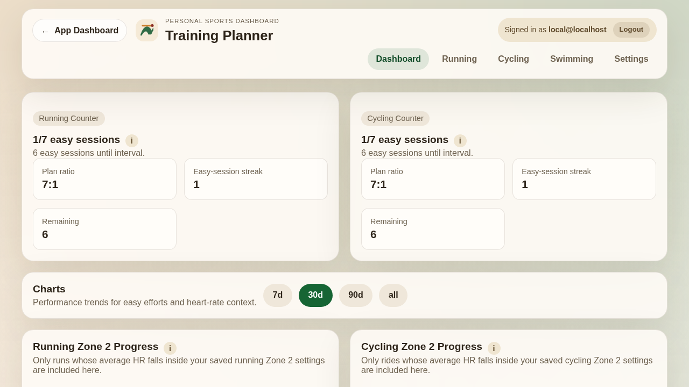
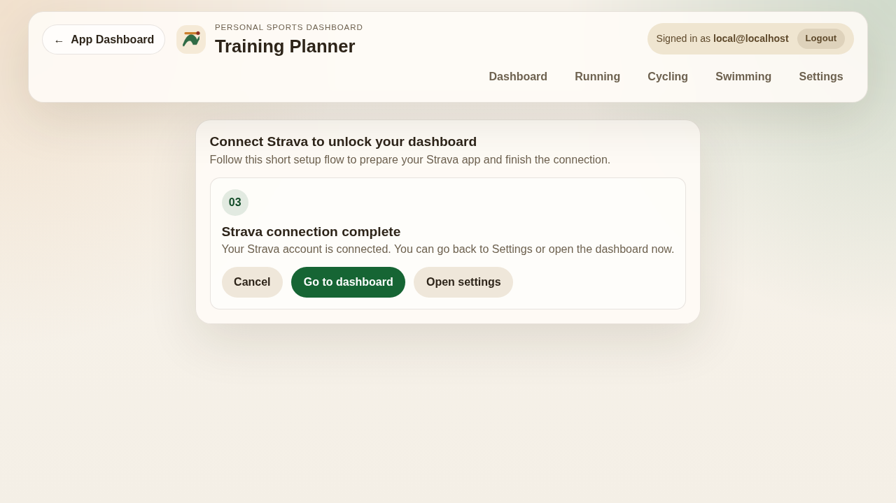
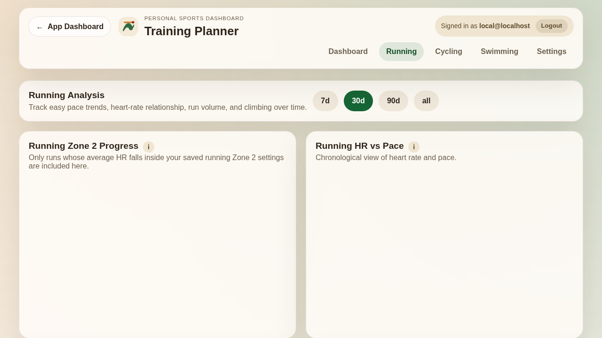
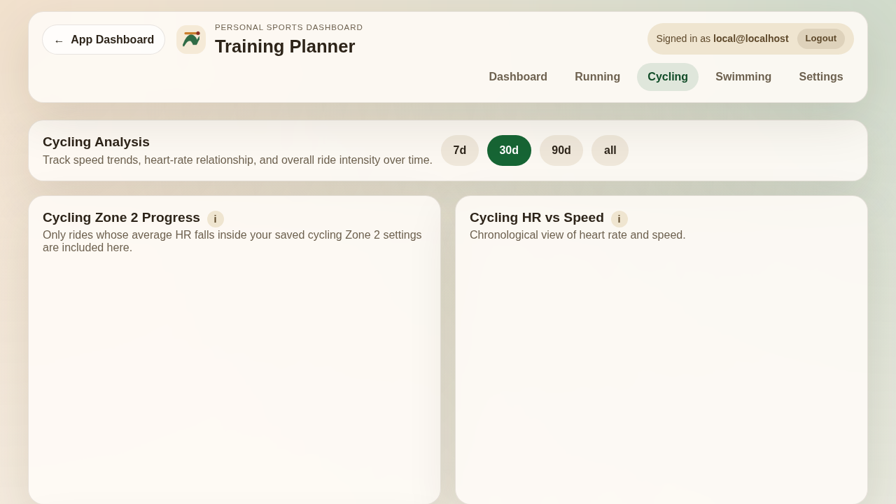
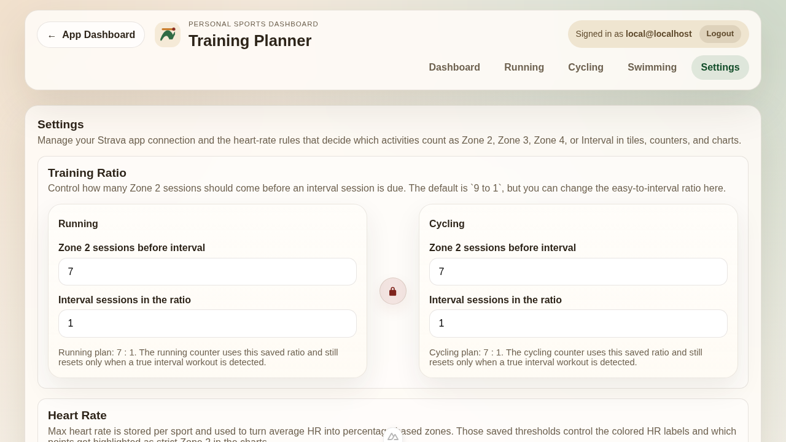

# Anwendungsdokumentation

Diese Dokumentation beschreibt die wichtigsten Funktionen des Training Planner aus Anwendersicht. Die eingebundenen Screenshots stammen aus der lokalen Entwicklungsumgebung und verwenden Mock-Daten, damit alle Bereiche der Anwendung sichtbar sind.

## 1. Überblick

Der Training Planner ist eine Webanwendung zur Auswertung von Strava-Aktivitäten. Die Anwendung fokussiert sich auf drei Sportarten:

- Laufen
- Radfahren
- Schwimmen

Im Mittelpunkt stehen:

- automatische oder manuelle Synchronisation von Strava-Daten
- Trainingssteuerung über Zone-2- und Intervall-Verhältnisse
- Herzfrequenz-basierte Auswertung für Laufen und Radfahren
- übersichtliche Diagramme und Aktivitätslisten
- benutzerspezifische Einstellungen

## 2. Dashboard

Das Dashboard ist die zentrale Startseite. Es bündelt die wichtigsten Kennzahlen und zeigt einen schnellen Überblick über den aktuellen Trainingsstand.

Funktionen des Dashboards:

- zwei Zählerkarten für den aktuellen Trainingsfortschritt von Laufen und Radfahren
- Diagramme zur Entwicklung von Zone-2-Einheiten
- Diagramme für Herzfrequenz im Verhältnis zu Pace oder Geschwindigkeit
- Diagramme zur relativen Belastung
- Liste der zuletzt importierten Aktivitäten
- Nachladen weiterer Aktivitäten über die Schaltfläche zum Laden weiterer Einträge

Besonders hilfreich ist das Dashboard für den schnellen Tagesüberblick: Man sieht sofort, wie viele lockere Einheiten bereits absolviert wurden und wann wieder eine intensivere Einheit fällig ist.



## 3. Strava-Einrichtung per Assistent

Die Verbindung zu Strava erfolgt über einen geführten Assistenten. Dadurch müssen Nutzer die benötigten Angaben nicht mehr manuell in den Einstellungen zusammensuchen.

Der Assistent unterstützt in mehreren Schritten:

- Anzeige der für Strava relevanten Angaben wie Website und Callback-Domain
- Kopieren der benötigten Werte per Klick
- Eingabe von Client-ID und Client-Secret
- Start des OAuth-Verbindungsprozesses mit Strava

Nach erfolgreicher Verbindung wird die Anwendung für den Datenimport freigeschaltet.



## 4. Analysebereich Laufen

Die Laufansicht bietet eine detaillierte Auswertung aller Laufaktivitäten.

Enthaltene Funktionen:

- Filterung der Diagramme nach Zeitraum
- Verlauf der Zone-2-Leistung
- Herzfrequenz im Verhältnis zur Pace
- relative Belastung
- Distanz im Verhältnis zur Dauer
- Höhenmeter-Auswertung
- Liste der einzelnen Laufaktivitäten

Die Aktivitätskarten enthalten neben den Kerndaten auch den Aktivitätstitel und, sofern vorhanden, die Beschreibung der Einheit. Dadurch lassen sich strukturierte Trainings wie Intervalle oder Long Runs leichter wiedererkennen.



## 5. Analysebereich Radfahren

Die Radansicht funktioniert analog zur Laufansicht, ist jedoch auf die Besonderheiten des Radsports abgestimmt.

Funktionen:

- Zeitraumsauswahl für die Auswertung
- Zone-2-Entwicklung beim Radfahren
- Herzfrequenz im Verhältnis zur Geschwindigkeit
- relative Belastung
- Aktivitätsliste mit den importierten Radeinheiten

Da Laufen und Radfahren getrennt betrachtet werden, können Fortschritt und Trainingssteuerung für beide Sportarten unabhängig analysiert werden.



## 6. Schwimmen

Für Schwimmen stellt die Anwendung eine eigene Aktivitätsliste bereit. Schwimmeinheiten werden angezeigt und importiert, fließen aber nicht in die Trainingszähler für Zone 2 und Intervalle ein. Dadurch bleibt die Logik für Lauf- und Radeinheiten konsistent.

## 7. Einstellungen

Die Einstellungsseite bündelt alle relevanten Konfigurationsmöglichkeiten für Training und Synchronisation.

### 7.1 Trainingsverhältnis

Das Trainingsverhältnis definiert, wie viele Zone-2-Einheiten vor einer Intervall-Einheit vorgesehen sind.

Besonderheiten:

- getrennte Einstellung für Laufen und Radfahren
- Lock-Symbol zwischen beiden Bereichen
- im gesperrten Zustand bleiben beide Verhältnisse identisch
- im entsperrten Zustand können beide Sportarten unabhängig konfiguriert werden

Beispiel:

- Laufen: 9 lockere Einheiten zu 1 Intervall-Einheit
- Radfahren: 6 lockere Einheiten zu 1 Intervall-Einheit

### 7.2 Herzfrequenz und Zonen

Die Anwendung erlaubt die getrennte Konfiguration der maximalen Herzfrequenz für Laufen und Radfahren. Zusätzlich lassen sich die Grenzen für die Trainingszonen individuell festlegen.

Dabei werden angezeigt:

- minimale Prozentwerte je Zone
- maximale Prozentwerte je Zone
- daraus berechnete bpm-Werte zur besseren Einordnung

### 7.3 Sprache

Die Oberfläche kann zwischen Deutsch und Englisch umgestellt werden.

### 7.4 Strava und Synchronisation

Im Strava-Bereich werden Verbindungs- und Synchronisationsinformationen angezeigt.

Dazu gehören:

- aktuelles Synchronisationsintervall
- Verbindungsstatus
- angemeldete Benutzerkennung
- Status der Strava-App-Konfiguration
- letzte Datenabfrage
- Status des letzten Abrufs
- Anzahl der in diesem Lauf importierten Aktivitäten

Zusätzlich gibt es zwei wichtige Aktionen:

- `Pull Strava data` startet einen manuellen Abruf
- `Reset Strava connection` trennt die aktuelle Strava-Verbindung

Das Synchronisationsintervall ist direkt in der Kachel bearbeitbar. Ein Wert unter 5 Minuten ist nicht erlaubt.



## 8. Aktivitätskarten und Diagramm-Interaktion

Die Aktivitätskarten zeigen die wichtigsten Informationen pro Einheit in kompakter Form. Dazu gehören je nach Sportart unter anderem:

- Titel der Aktivität
- Datum
- Distanz
- Dauer
- Herzfrequenz
- Beschreibung der Trainingseinheit

In den Diagrammen werden beim Überfahren oder Antippen eines Punktes zusätzliche Informationen eingeblendet. Die Anzeige wurde so erweitert, dass sie nicht nur das Datum, sondern auch den Titel der jeweiligen Aktivität zeigt.

Format im Tooltip:

```text
<Aktivitätstitel>
<Datum>
```

Für mobile Geräte wurde das Verhalten verbessert, damit eingeblendete Hinweise und Info-Popover wieder verschwinden, wenn außerhalb des Bereichs getippt wird.

## 9. Synchronisation und Datenverhalten

Nach erfolgreicher Strava-Verbindung importiert die Anwendung Aktivitäten und ordnet sie der angemeldeten Benutzerkennung zu. Die Datenhaltung ist nutzerbezogen, sodass mehrere Benutzer getrennte Datenbestände haben können.

Wichtige Eigenschaften:

- automatische periodische Synchronisation
- zusätzlicher manueller Abruf möglich
- Importstatus direkt in den Einstellungen sichtbar
- Mock-Verbindung und Mock-Aktivitäten in der Entwicklungsumgebung möglich

