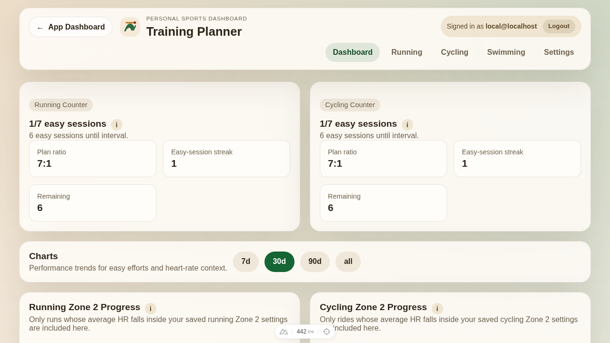
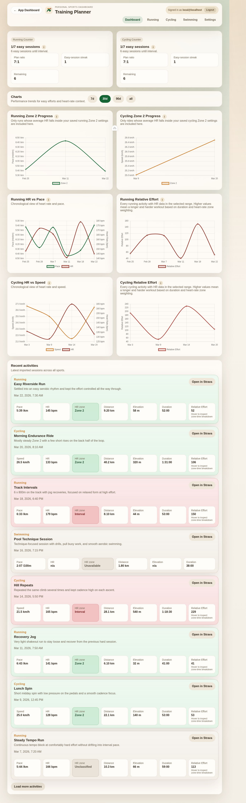

# Training Planner: Technical Architecture and Feature Overview

The Training Planner is a Nuxt 3 full-stack application designed to serve as a private, self-hosted Strava dashboard. Deployed on a Raspberry Pi 5 via Docker, it securely aggregates workout data using SQLite and provides advanced analytics through componentized Chart.js visualizations.

---

## Technical Architecture & Data Ingestion

At its core, the application integrates directly with the Strava OAuth API, pulling down the past 12 months of activity history upon first authenticated login. 

Subsequent updates are managed by a server-side polling service that executes every 30 minutes. To prevent duplication and minimize API overhead, incremental syncs query only from the latest stored activity date minus one day. All raw activity payloads are stored persistently in a local SQLite database (`better-sqlite3`), isolating the backend from external cloud dependencies. Multi-tenancy is handled via Cloudflare Access, separating data implicitly by the authenticated user's email.

---

## Analytical Graph Rendering

Instead of relying on basic telemetry logs, the web interface heavily utilizes `vue-chartjs` alongside `Chart.js` to render connected line charts. 

**Chronological Line Series:** Both the progress and HR/performance charts display metrics chronologically as connected lines rather than a scatter plot. This design choice maintains interface clarity and readability, especially when rendering dense training weeks on narrow mobile viewpoints. Performance charts plot the dual metrics (e.g., Average Power vs. Distance for rides) along distinct Y-axis scales, ensuring clear correlation visibility.

---

## Sport-Specific Classification & Relative Effort Algorithms

Crucially, the backend does not enforce a monolithic physiological model. Running and cycling each utilize independent maximum heart-rate parameters and configurable zone thresholds.

### 1. Heart Rate Classification
The engine classifies an entire session into a dominant zone strictly based on the **average heart rate**, calculated as `(averageHr / maxHr) * 100`. 

For instance, default running zones are parameterized as follows:
- **Zone 2:** 70–80%
- **Zone 3:** 81–87%
- **Zone 4:** 88–93%
- **Interval:** 94–100%

Swimming data is parsed and displayed but explicitly excluded from physiological aggregation logic, ensuring HR drift and missing water telemetry do not skew running and cycling averages.

### 2. Relative Effort (TRIMP-Style Calculation)
In addition to simple boundary classification, the application calculates a finely-grained **Relative Effort Score** by parsing the raw telemetry streams (second-by-second). This logic mirrors established physiological algorithms (like TRIMP):

1. **Zone Multiplying Weights:** Time spent in each zone is multiplied by an increasing severity factor:
   - Z1 = `1x`
   - Z2 = `2x`
   - Z3 = `3x`
   - Z4 = `5x`
   - Z5/Interval = `8x`
2. **Integration:** `weightedLoadSeconds = Δt * ZoneWeight(hrPercent)`
3. **Normalization:** The accumulated load is normalized via `RELATIVE_EFFORT_NORMALIZATION_DIVISOR = 120` to yield the final score: `(weightedLoadSeconds / 120)`.

If high-resolution data streams are unavailable from Strava, the system degrades gracefully and applies the zone weight of the session's overall average HR to the total duration.

---

## State Machine: The Easy-Session Streak

To systemically enforce polarized training modalities, the Training Planner implements a chronologically-evaluated "9-Easy-Session" state machine for both running and cycling.

The streak (`easyStreak`) evaluates the historical sequence iteratively backwards from the most recent session, terminating upon detecting intense threshold work.

The state transitions strictly enforce aerobic compliance:
- `INCREMENT`: When the session average HR falls under the defined **Zone 2** threshold (`isEasySession = true`).
- `NO-OP (Skip)`: When the session falls into **Zone 3** or **Zone 4**, preserving the streak tally without rewarding the effort. This offers flexibility for "grey zone" efforts without punishing the athlete.
- `RESET`: When the session triggers the **Interval** bracket (`classification === 'interval'`). The sequence records `lastResetAt = activity.startDate` and resets the base-building cycle (`easyStreak = 0`), requiring the athlete to build base endurance again.
